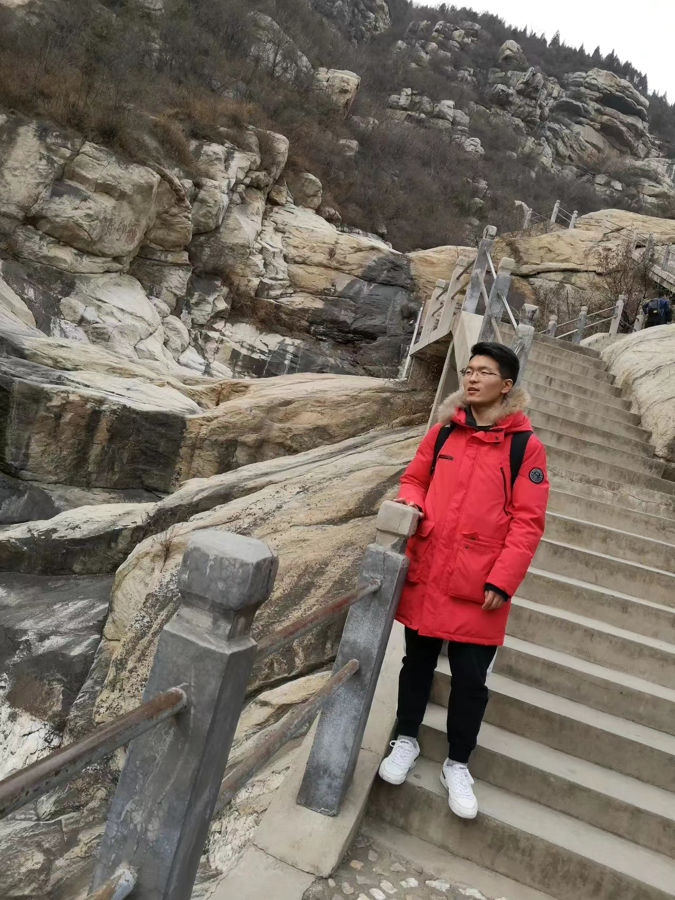
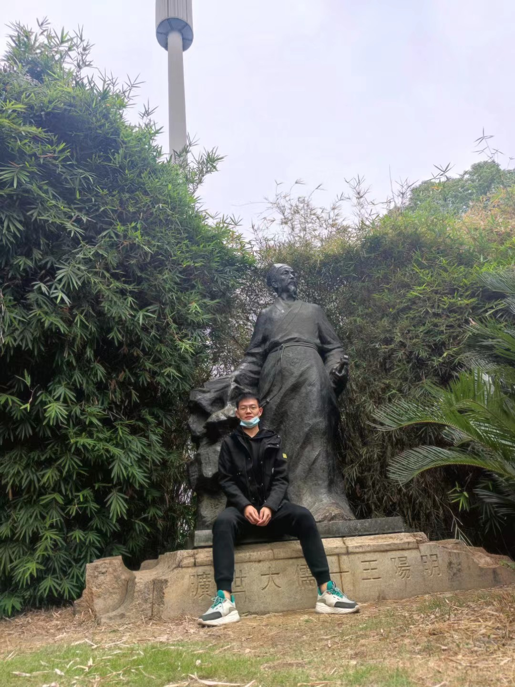
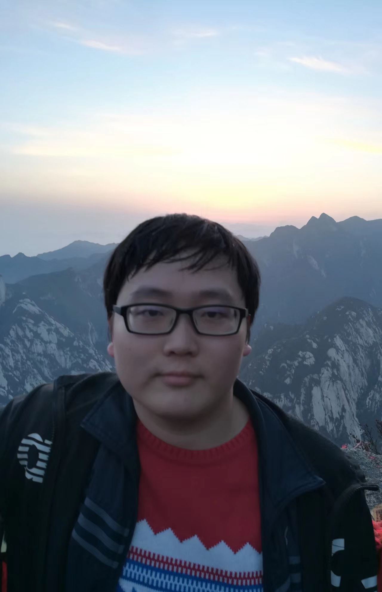
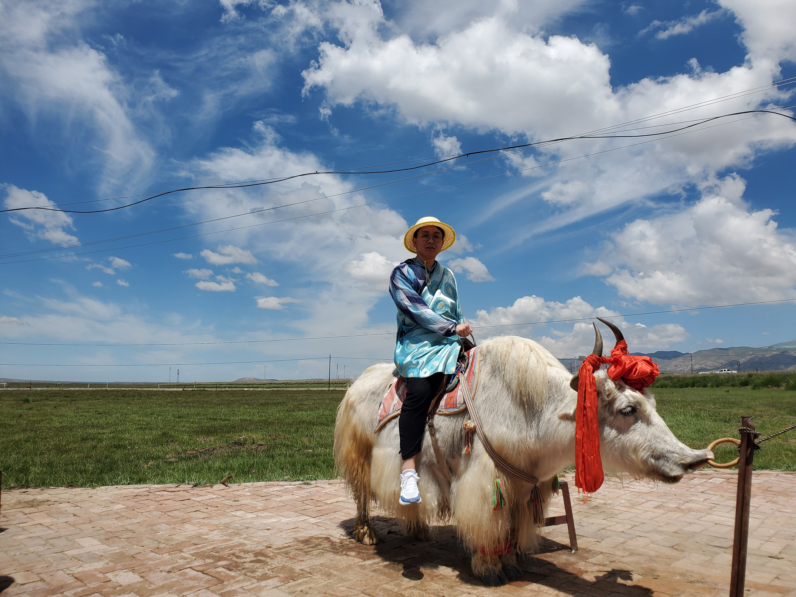
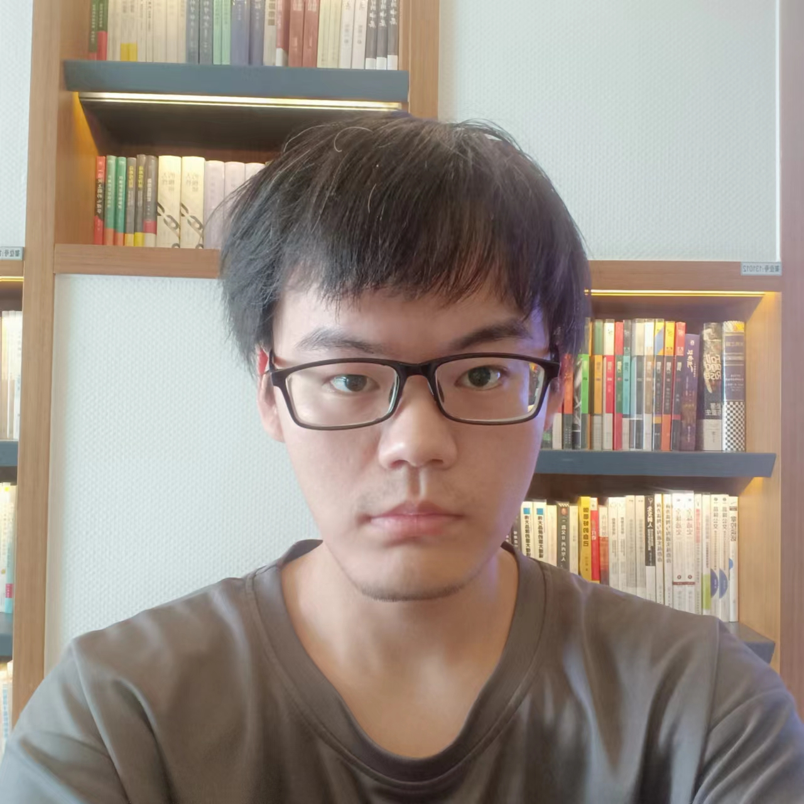
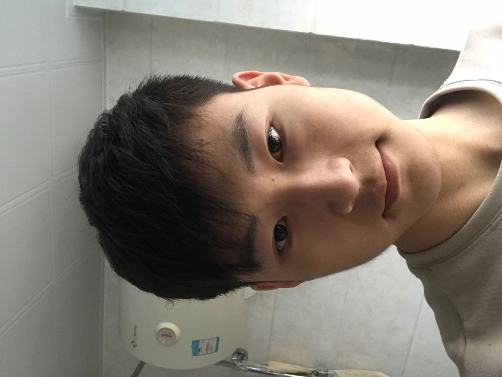
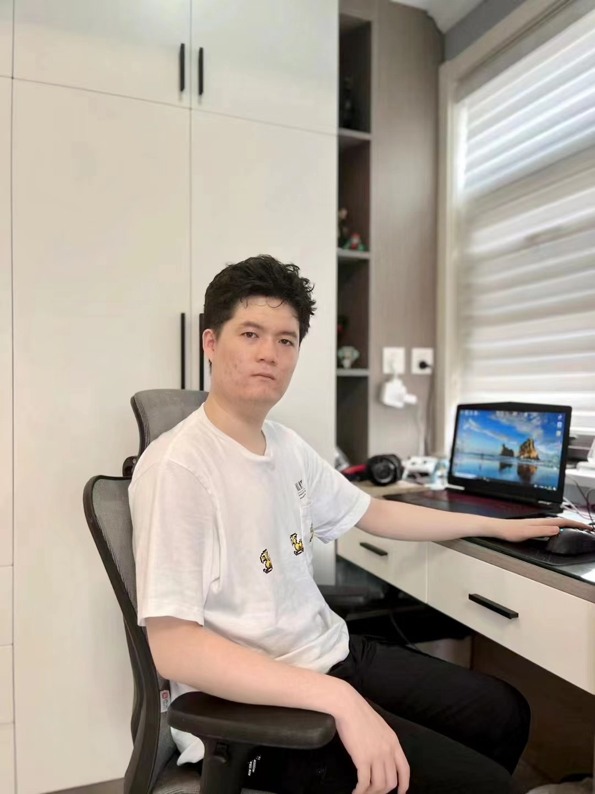
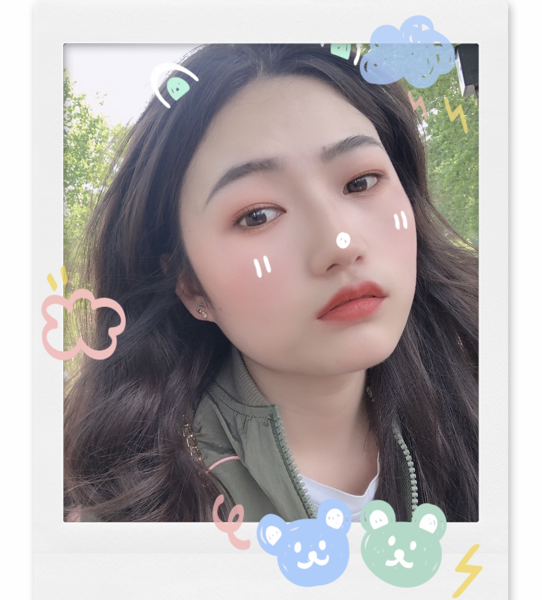
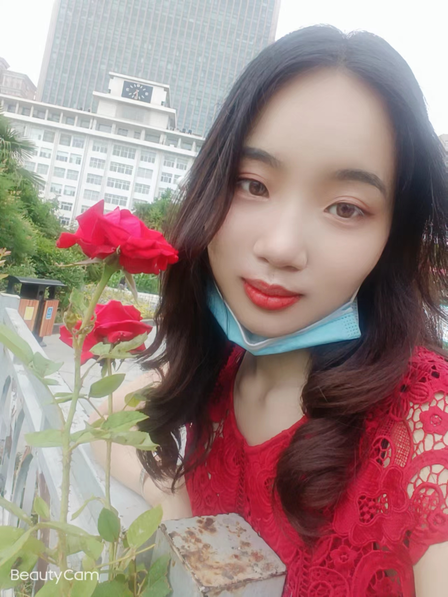

## Faculty
---
<figure>
  
</figure>

> 薛均晓 副教授, xuejx@zzu.edu.cn

## Master Students
---

> Mingchuang Zhang (张明闯)，2020级

> Bowei Dong (董博威)，2020级

> Hao Zhou (周昊)，2020级

> Jie Wang (王杰)，2021级

> Shiwen Zhang (张世文)，2021级

> Huaifei Ji (季怀飞)，2022级

> Jia Tian (田嘉)，2022级

> Yihang Guo (郭逸航)，2022级

## Graduated Students
---

> Chenyang Sun (孙晨阳)，2016级

> Hui Yin (殷辉)，2016级

> Haiyu Yu (于海玉)，2017级

> Junjin Cheng (程君进)，2018级

> Xiangyan Kong (孔祥燕)，2019级

